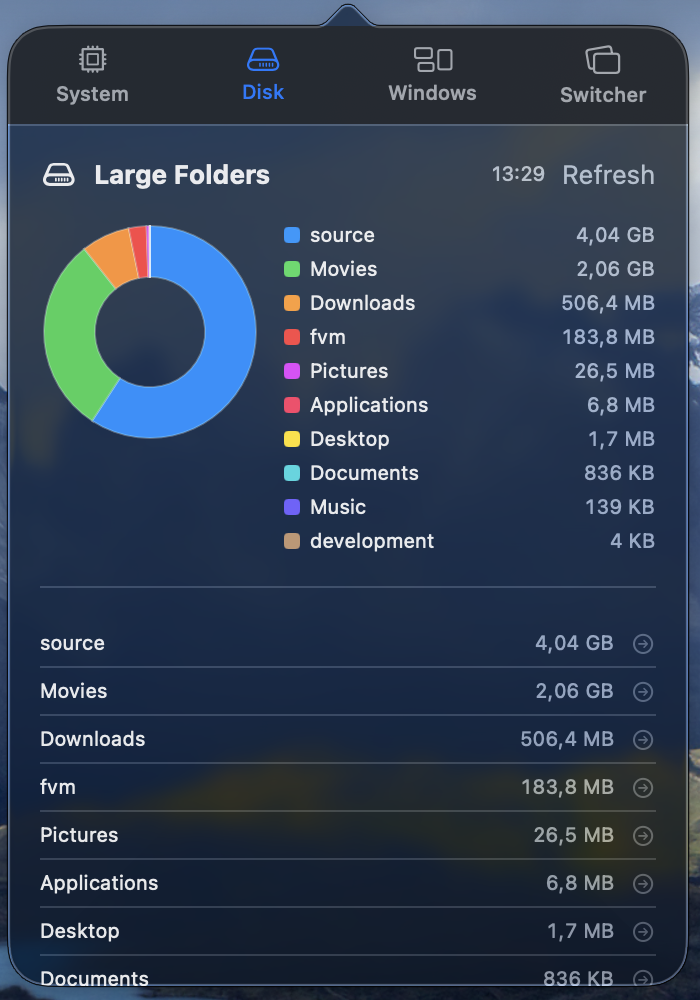
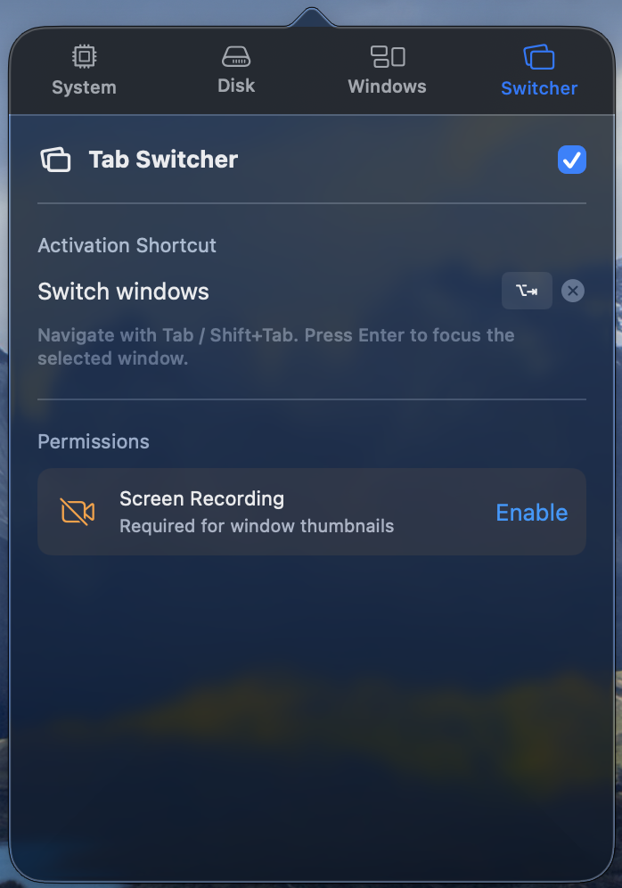

# tully

> A lightweight macOS menu bar utility for system monitoring, disk analysis, window tiling, and a smarter window switcher. No App Store. No subscription. No telemetry.

---

## ✨ Features at a glance

|              🖥️ System Monitor               |              💾 Disk Utility               |
| :------------------------------------------: | :----------------------------------------: |
|  |  |

|               🪟 Window Tiling                |                    🔀 Tab Switcher                     |
| :-------------------------------------------: | :----------------------------------------------------: |
|  |  |

---

## 🖥️ System Monitor

Real-time system vitals in a single glance.

- **CPU & RAM ring gauges** — circular progress arcs with live percentage; hover for exact usage tooltip (`X.X% used` / `X.X GB / Y GB`)
- **Network sparkline** — 1-minute rolling chart of download (blue) and upload (orange) bandwidth; auto-scales to peak
- **Local IP** — shows the active network interface address below the chart
- **Process list** — top processes sorted by RAM, with name, PID, and memory usage; kill any process with one click (SIGTERM + confirmation dialog)

---

## 💾 Disk Utility

Find out what's eating your storage.

- Scans home directory and ranks folders by size
- **Donut chart** of top 10 folders + "Others" segment
- Tap any folder row to open it directly in Finder
- One-click **Refresh** to re-scan on demand (not automatic — no background drain)

---

## 🪟 Window Tiling

Snap any window to a predefined zone with a keyboard shortcut.

- **12 zones** — Left/Right half, thirds, two-thirds, fullscreen, and four corners
- Fully customisable global shortcuts — click a row to record, `✕` to clear
- **Conflict detection** — duplicate shortcuts highlighted in red
- Requires macOS **Accessibility** permission

---

## 🔀 Tab Switcher

A keyboard-driven window switcher with live previews — fixes the macOS limitation of switching between windows of the same app.


**How it works:**

1. Press your configured activation shortcut (e.g. `⌥Space`) to open the switcher overlay
2. All visible windows appear as cards with **live ScreenCaptureKit thumbnails** (or the app icon if Screen Recording isn't granted)
3. Hold the activation modifier and press **Tab** / **Shift+Tab** to cycle through windows
4. **Release the modifier** to instantly bring the selected window to front — no need to press Enter
5. Press **Esc** to dismiss without switching

**Layout:**

- Up to **6 windows per row**, wraps to additional rows automatically
- Overlay size adapts to the number of open windows — not full-screen
- Ultra-thin material background, centered on the primary display

**Permissions required:**

- 🔐 **Accessibility** — to raise windows via AX API
- 🎥 **Screen Recording** — for live window thumbnails (falls back to app icon if denied)

---

## ⚙️ Requirements

- macOS 26 (Sequoia) or later
- Xcode 26 (to build from source)

---

## 🚀 Run locally

```bash
git clone https://github.com/simone98dm/tully.git
cd tully
open tully.xcodeproj
```

Then **Product → Run** in Xcode, or via terminal:

```bash
xcodebuild -project tully.xcodeproj -scheme tully -configuration Debug build
```

Built app location:

```
~/Library/Developer/Xcode/DerivedData/tully-*/Build/Products/Debug/tully.app
```

Open it — look for the icon in the menu bar.

---

## 📋 First launch checklist

| Step                 | What to do                                                                                              |
| -------------------- | ------------------------------------------------------------------------------------------------------- |
| **Accessibility**    | System Settings → Privacy & Security → Accessibility → enable tully                                     |
| **Screen Recording** | System Settings → Privacy & Security → Screen Recording → enable tully _(Tab Switcher thumbnails only)_ |
| **Gatekeeper**       | App is unsigned — right-click → Open to bypass the first-launch warning                                 |

---

## 🗒️ Notes

- Disk scanning is **on demand** — tap **Refresh** in the Disk tab. Never runs in background.
- Keyboard shortcuts and Tab Switcher hotkey are stored in `UserDefaults` and persist across restarts.
- The Tab Switcher only shows **on-screen, normal-layer windows** (no minimised windows, no desktop elements).
