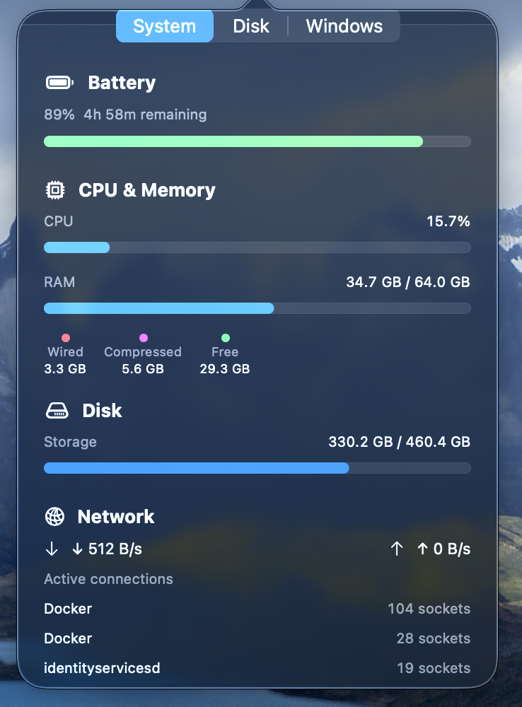
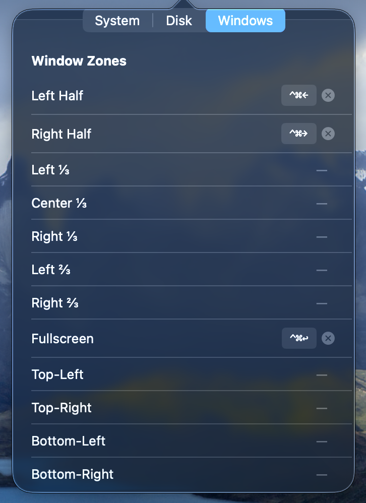

# tully

A lightweight macOS menu bar utility for system monitoring and window management. No App Store, no subscription, no telemetry.

| System page                               | Windows Tiling                            |
| ----------------------------------------- | ----------------------------------------- |
|  |  |

## Features

**System Monitor**

- CPU usage, RAM with wired/compressed breakdown, disk used/total
- Global network bandwidth (↓↑ bytes/s)
- Top 5 processes by CPU and RAM
- Top 3 processes by active network connections
- Battery status, charge %, time remaining, cycle count (MacBook only)

**Disk & Utility**

- Scans home directory and lists largest folders
- Donut chart of top 10 folders + "Others"
- Tap any folder to open it in Finder
- One-click cleanup via [mole](https://github.com/tw93/mole) (`mo clean` opens in Terminal)

**Window Manager**

- 12 predefined window zones: halves, thirds, two-thirds, fullscreen, corners
- User-configurable global keyboard shortcuts
- Conflict detection highlighted in red
- Requires macOS Accessibility permission

## Requirements

- macOS 26 (Sequoia) or later
- Xcode 26
- For cleanup: `brew install tw93/mole/mole`

## Run locally

```bash
git clone https://github.com/simone98dm/tully.git
cd tully
open tully.xcodeproj
```

Then **Product → Run** in Xcode, or from the terminal:

```bash
xcodebuild -project tully.xcodeproj -scheme tully -configuration Debug build
```

The built app is at:

```
~/Library/Developer/Xcode/DerivedData/tully-*/Build/Products/Debug/tully.app
```

Open it and look for the target icon in the menu bar.

**First launch:** grant Accessibility permission when prompted (System Settings → Privacy & Security → Accessibility). Required for the Window Manager. The app will show a prompt if permission is missing.

## Notes

- The app is unsigned and not sandboxed — Gatekeeper may block it on first open. Right-click → Open to bypass.
- Disk scanning runs on demand only (tap **Refresh** in the Disk tab). Not automatic at startup.
- Keyboard shortcuts are stored in `UserDefaults` and persist across restarts.
